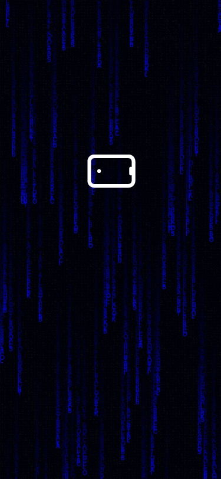
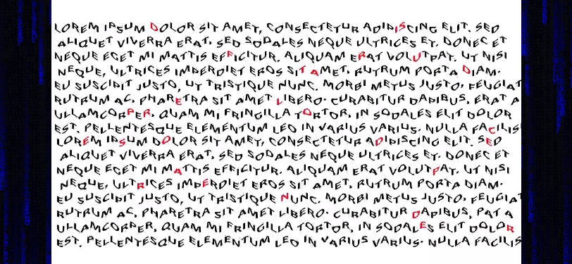
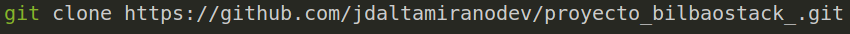

# Proyecto Bilbostack (pistas)

## Puede ver la página de Pista 3 desplegada en Netlify [Pista 3](https://pista-3.netlify.app/)

 
 

## Tabla de contenido

1. Información general
2. Estado actual
3. Tecnologías utilizadas
4. Instalación y prueba
5. Marcos de competencia

## Información general

Web estatica Pista 3 Consta de:

* Inicio: Página donde se muestra una animación que indica al usuario que se debe girar el móvil para poder visualizar el contenido.

## Estado actual

Finalizado.

## Tecnologías utilizadas

* HTML5
* CSS3
* Animate
* Javascript
* Canvas
* Linux
* Terminal
* Git
* GitHub
* Netlify
* Visual Studio Code
* Trello

## Instalación y prueba

1. Copia la URL del proyecto
   
```
https://github.com/jdaltamiranodev/proyecto_bilbaostack_.git
```

2. Abra una terminal, selecione la carpeta donde desea clonar el proyecto, después use el comando git clone y pegue la URL al final dejando un espacio.
3. Finalmente pulse enter. (Tenga en cuenta que debe tener instalado git)

 

```
$ git clone https://github.com/jdaltamiranodev/proyecto_bilbaostack_.git
```
* Opcional: Puede copiar y pegar la linea anterior en su terminal en la carpeta elegida para clonar el proyecto.

4. Navegue hasta la carpeta clonada, abra el archivo index.html. Presione el botón derecho del ratón y elija la opción "Abrir en navegador predeterminado". Se abrira el navegador en la pagina principal del proyecto y podrá navegar por el mismo.
   
## Marcos de competencia

* HTML5
* CSS3
* Animate
* Javascript
* Canvas
* Tabler Icon
* Responsive Design
* Responsively
* Linux
* Terminal
* Chrome
* Firefox
* Safari
* Git
* GitHub
* Netlify
* Visual Studio Code
* Trello
  
